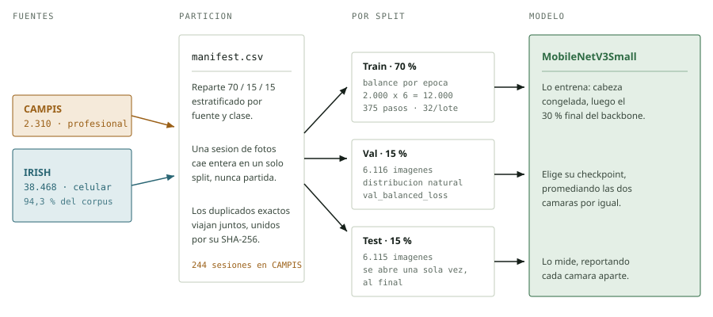
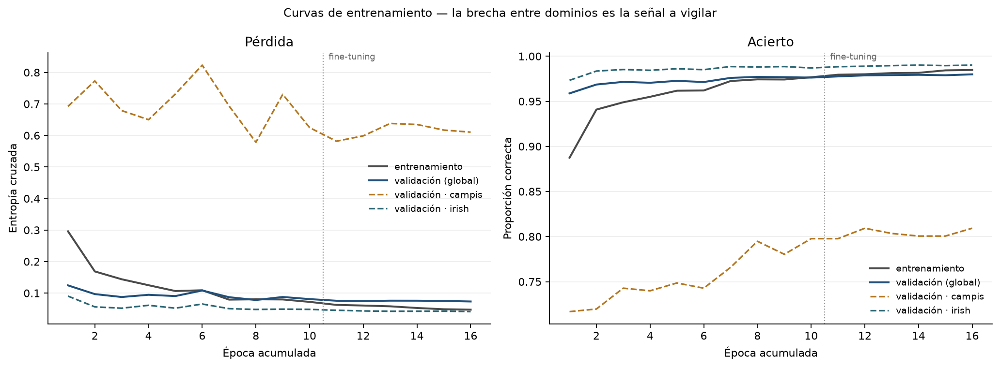
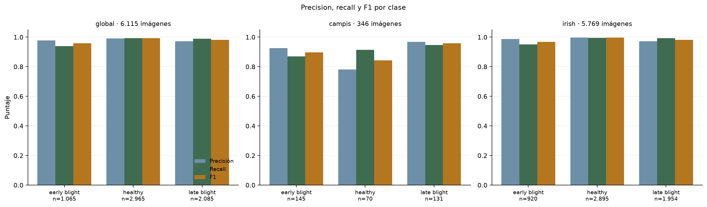
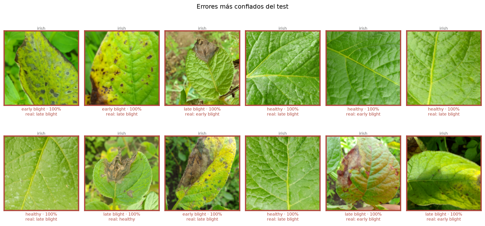

# CAMPIS Vision

**Clasificación de enfermedades en hojas de papa —`early_blight`, `healthy`, `late_blight`— desde dos cámaras distintas.**

Una cámara profesional y un celular fotografiaron las mismas tres enfermedades, y el celular aportó veinticinco veces más imágenes. Todo el diseño de este pipeline existe para que ese desbalance no decida el resultado, y para que las métricas digan la verdad sobre cada cámara por separado.

<picture>
  <source media="(prefers-color-scheme: dark)" srcset="docs/diagrama-pipeline-dark.svg">
  
</picture>

Las dos cámaras siguen siendo distinguibles en todo el recorrido. El mismo modelo recibe las tres particiones en tres papeles distintos: **train** lo entrena, **val** decide cuál de sus versiones se guarda, **test** solo lo mide.

---

## Resultados

Corrida `20260820T043508Z-limpio-dedup` · MobileNetV3Small · 16 épocas · 6.115 imágenes de test.

| Dominio | Accuracy | Macro F1 | Imágenes |
|---|---:|---:|---:|
| **Global** | **98,25 %** | 0,977 | 6.115 |
| Irish · celular | 98,70 % | 0,982 | 5.769 |
| **CAMPIS · profesional** | **90,75 %** | 0,899 | 346 |

**La brecha de ocho puntos entre las dos cámaras es el hallazgo principal.** Un reporte que dijera solo «98,25 %» la habría escondido por completo: Irish es el 94 % del corpus y domina cualquier promedio global. Medir cada dominio por separado es lo que la hace visible.

### Por clase

<table>
<tr><th>Clase</th><th colspan="3">Global</th><th colspan="3">CAMPIS</th><th colspan="3">Irish</th></tr>
<tr><th></th><th>P</th><th>R</th><th>F1</th><th>P</th><th>R</th><th>F1</th><th>P</th><th>R</th><th>F1</th></tr>
<tr><td><code>early_blight</code></td><td>0,978</td><td>0,940</td><td>0,959</td><td>0,926</td><td>0,869</td><td>0,897</td><td>0,986</td><td>0,951</td><td>0,968</td></tr>
<tr><td><code>healthy</code></td><td>0,992</td><td>0,993</td><td>0,992</td><td><b>0,780</b></td><td>0,914</td><td>0,842</td><td>0,998</td><td>0,994</td><td>0,996</td></tr>
<tr><td><code>late_blight</code></td><td>0,972</td><td>0,990</td><td>0,981</td><td>0,969</td><td>0,947</td><td>0,958</td><td>0,972</td><td>0,993</td><td>0,982</td></tr>
</table>

El punto débil está señalado: en CAMPIS, **17 de 145 hojas con tizón temprano se clasificaron como sanas**. Por eso la precisión de `healthy` cae a 0,780 — cuando el modelo dice «sana», una de cada cinco veces se equivoca. En uso agronómico ese es el error caro.

### Curvas de entrenamiento



Las dos fases van encadenadas en un eje continuo; la línea punteada vertical marca dónde empieza el fine-tuning. Las dos series discontinuas son la validación de cada cámara: **Irish se clava en 0,99 desde la época 2 mientras CAMPIS todavía sube de 0,72 a 0,81 cuando el entrenamiento se detiene.** El modelo seguía aprendiendo el dominio profesional.

### Métricas por clase y dominio



### Errores más confiados



Equivocarse con alta confianza suele delatar etiquetas dudosas antes que ruido estadístico. Es el diagnóstico más informativo del test.

Las nueve figuras completas —incluidas las tres matrices de confusión y la distribución de confianza— están en [`artifacts/runs/20260820T043508Z-limpio-dedup/`](artifacts/runs/20260820T043508Z-limpio-dedup/).

---

## El dataset

> [!IMPORTANT]
> **Las imágenes no están en este repositorio.** Son ~9 GB de datos crudos y quedan fuera por `.gitignore`. Lo que sí se versiona es todo lo necesario para reconstruir el corpus exacto: el reporte de auditoría, el inventario de exclusiones y el manifest resumido.

Dos fuentes con la misma taxonomía de tres clases:

| Fuente | Cámara | Original | **Utilizado** | Del corpus |
|---|---|---:|---:|---:|
| `dataset_campis` | Profesional | 2.312 | **2.310** | 5,7 % |
| `dataset_irish` | Celular | 58.709 | **38.468** | 94,3 % |
| | | **61.021** | **40.778** | 100 % |

Composición final por clase:

| Fuente | early_blight | healthy | late_blight | Total |
|---|---:|---:|---:|---:|
| CAMPIS | 966 | 468 | 876 | 2.310 |
| Irish | 6.137 | 19.302 | 13.029 | 38.468 |

Las dos fuentes también difieren en geometría: **CAMPIS son fotos cuadradas** de hasta 4000 × 4000 px, **Irish son 4:3** de alrededor de 1000 px. Por eso el preprocesamiento recorta el cuadrado central antes de redimensionar a 224 × 224 — sin ese recorte solo Irish se deformaría, y la relación de aspecto quedaría como una pista espuria del dominio de captura.

### Limpieza aplicada

Se apartaron **20.243 archivos** a `datasets/dataset_fallido/`, que replica la misma composición de carpetas. Ninguno se borró, y cada movimiento quedó registrado con origen, destino, razón y hash en [`artifacts/reports/dataset_fallido.csv`](artifacts/reports/dataset_fallido.csv).

| Razón | Archivos | Por qué |
|---|---:|---|
| `duplicado` | 19.913 | Copias byte a byte exactas. Se conservó una por grupo. |
| `conflicto_etiqueta` | 326 | Contenido idéntico archivado bajo dos clases distintas. Sin criterio automático para decidir cuál vale, se apartaron todas las copias del grupo. |
| `corrupta` | 2 | Ilegibles para Pillow. |
| `jpeg_ilegible` | 2 | JPEG truncados que Pillow aceptaba y TensorFlow rechazaba a mitad del entrenamiento. |

Casi la mitad del corpus original de Irish eran copias exactas. Eso significa que su volumen aparente exageraba mucho la información independiente que aportaba.

Verificación final del corpus utilizado:

```
Imágenes válidas: 40.778
Imágenes inválidas: 0
Grupos duplicados exactos: 0
Conflictos de etiqueta: 0
Ilegibles para TensorFlow: 0
```

Para reconstruirlo, colocá las imágenes originales así y ejecutá la auditoría:

```text
datasets/
├── dataset_campis/{early_blight,healthy,late_blight}/
└── dataset_irish/{early_blight,healthy,late_blight}/
```

---

## Cómo se ejecuta

```powershell
python -m venv .venv
.\.venv\Scripts\Activate.ps1
python -m pip install -r requirements.txt

python run.py audit   --config configs/default.toml --decode-tf
python run.py prepare --config configs/default.toml
python run.py train   --config configs/default.toml --run-name mi-corrida
```

`train` entrena las dos fases, evalúa el test, exporta Keras + TFLite con su prueba de paridad y genera las nueve figuras. En CPU tarda entre 45 y 60 minutos; TensorFlow ≥ 2.11 no usa GPU en Windows nativo.

Otros comandos: `evaluate`, `export`, `predict`, `report` (regenera las figuras de cualquier corrida) y `doctor`.

---

## Decisiones que sostienen los resultados

Cada una responde a un problema concreto que apareció al construir esto.

**Las sesiones de captura no se parten entre splits.** Una sesión se reconoce por la marca temporal del nombre, por marcas epoch, o por corridas del contador de la cámara (`IMG_0051`, `IMG_0052`, `IMG_0054`). Sin esta última regla, 1.202 de las 2.312 fotos CAMPIS quedaban sueltas y podían repartirse entre train y test. Agruparlas redujo las unidades independientes de 1.408 a 244 e infla mucho menos el resultado.

**El balance se resuelve por época, no antes.** Cada combinación fuente × clase se baraja y repite por separado dentro de `tf.data`, y la época se arma en turnos entre los seis grupos. Cada época contiene 2.000 referencias de cada grupo, pero la fuente mayoritaria aporta imágenes **distintas** en cada vuelta. Un submuestreo fijo previo habría condenado al modelo a ver siempre las mismas 6.000 imágenes de Irish y descartar el resto.

**La selección de modelo promedia los dominios.** Validación conserva la distribución natural, donde Irish es el 94 %. Si el checkpoint se eligiera por la pérdida global, esa sola cámara decidiría. El entrenamiento monitorea `val_balanced_loss`, el promedio simple entre dominios, y registra `val_campis_*` y `val_irish_*` en cada época.

**La auditoría descomprime de verdad.** El `verify()` de Pillow valida marcadores sin decodificar, así que aprueba un JPEG cortado a mitad del scan que después revienta dentro de `tf.data`. La verificación llama también a `load()`, y `--decode-tf` pasa cada imagen por el decodificador real de TensorFlow.

**La paridad TFLite se juzga por la decisión, no por un valor suelto.** Falla si cambia la clase predicha en una imagen cuyo margen superaba la tolerancia, si la desviación media excede su límite, o si la del percentil 99 excede el suyo. El máximo se reporta pero no decide: la distribución del error de cuantización es muy sesgada —mediana 0,00001, algún caso aislado en 0,19— y el máximo de una muestra sesgada crece al comparar más imágenes. Resultado en esta corrida: **64/64 clases coincidentes, p99 = 0,043**.

El detalle técnico completo está en [`docs/pipeline.md`](docs/pipeline.md).

---

## Límites conocidos

**Irish no expone sesiones.** Sus nombres correlativos no prueban que dos fotos vengan de la misma planta, así que no se agrupan. Si se conoce esa relación, incorporarla como `group_id` haría el test más estricto.

**El test de CAMPIS es pequeño.** 346 imágenes provenientes de pocas sesiones independientes. Es el número correcto —agrupar bien reduce el tamaño efectivo— pero su intervalo de confianza es amplio: en validación el mismo modelo daba 0,80 y en test dio 0,91. Esa diferencia es ruido de muestreo, no mejora. **Reportar el resultado de CAMPIS como aproximado, nunca como cifra exacta.**

**SHA-256 solo ve copias idénticas.** Un recorte, un reencuadre o una recompresión de la misma foto pasan como imágenes distintas. La detección de sesiones cubre buena parte de eso en CAMPIS, no en Irish, donde probablemente aún quedan near-duplicates.

---

## Estructura

```text
├── src/campis/          # audit, config, data, modeling, training,
│                        # evaluation, exporting, reporting, inference, cli
├── configs/             # default.toml y smoke.toml
├── tests/               # 64 pruebas
├── artifacts/           # reportes, métricas y figuras versionadas
├── docs/                # documentación técnica y diagramas
└── datasets/            # datos crudos locales, fuera del repositorio
```

```powershell
python -m unittest discover -s tests -t . -v
```

Las pruebas no descargan pesos de ImageNet. Cubren configuración, agrupación de sesiones, split sin intersecciones, balance por época, recorte cuadrado, `tf.data`, modelo, fine-tuning, validación por dominio, evaluación por fuente, figuras y criterios de paridad TFLite.
